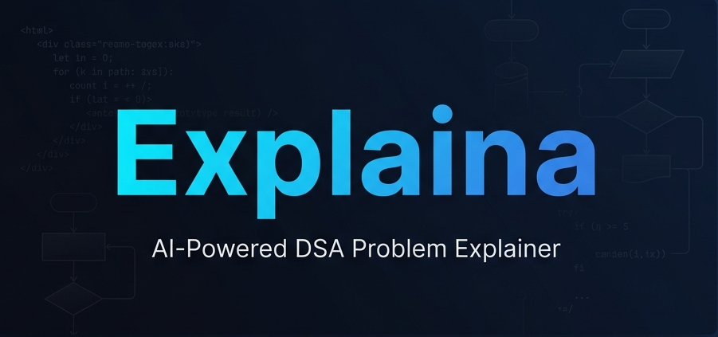

<p align="center">
  
</p>

<h1 align="center">Explaina</h1>

<p align="center">
  <strong>AI-Powered DSA Problem Explainer — Built for Interview Prep, Not Conversations</strong>
</p>

<p align="center">
  
  
  
  
  
</p>

---

## 🤔 Why Explaina Over Any AI Chatbot?

You might ask — _"Why not just ask ChatGPT or Gemini?"_ Here's why Explaina exists:

| Feature                 | Generic AI Chatbot                                          | Explaina                                                                   |
| ----------------------- | ----------------------------------------------------------- | -------------------------------------------------------------------------- |
| **Output Format**       | Varies wildly between sessions                              | Consistent, structured 8-section format every single time                  |
| **Interview Focus**     | Gives verbose, textbook-style answers                       | Gives interview-ready breakdowns: Intuition → Brute Force → Optimal → Code |
| **Code Quality**        | May include boilerplate, comments, or non-LeetCode patterns | Clean, LeetCode-format code ready to submit                                |
| **Input Flexibility**   | Requires well-formed prompts                                | Just type `"1. Two Sum"` or paste the full description — it figures it out |
| **Complexity Analysis** | Often uses LaTeX ($O(n)$) that doesn't render               | Always plain-text — `O(n)`, `O(n log n)` — renders perfectly               |
| **Conversation Drift**  | Adds "Let me know if you need more help!" filler            | Zero filler. Pure technical content. One-shot reference tool.              |
| **Edge Cases**          | Usually skipped                                             | Dedicated section with relevant corner cases                               |
| **Dedicated UI**        | Chat interface built for general Q&A                        | Purpose-built interface with chat history, language selector, and sidebar  |

### The Core Philosophy

> **Explaina is not a chatbot. It's a reference tool.**  
> You paste a problem. You get a structured, interview-grade explanation. That's it.

Every response follows the exact same battle-tested format:

```
1. Intuition          → Why does this approach work?
2. Brute Force        → The naive solution
3. Optimized Approach → The interview answer
4. Time Complexity    → Plain-text Big-O analysis
5. Space Complexity   → Auxiliary space only
6. Edge Cases         → Relevant corner cases
7. Code               → One clean, submittable code block
8. Related Topics     → DSA patterns to study next
```

No hallucinated follow-ups. No filler. No "Happy coding!" at the end.

---

## ✨ Features

- **AI-Powered Explanations**: Powered by Meta's Llama 3.3 70B via Groq for fast, high-quality reasoning
- **Multi-Format Input**: Accepts problem numbers, titles, full descriptions, or your own paraphrased explanations
- **5 Language Support**: Get code in Python, JavaScript, Java, C++, or Go
- **Chat History**: All past explanations are saved and organized in the sidebar
- **Rename & Delete**: Manage your saved explanations with inline rename and delete
- **Authentication**: Secure JWT-based signup/login with protected routes
- **Glassmorphic UI**: Premium dark-mode interface with cyan-blue gradient accents
- **Fully Responsive**: Works seamlessly on desktop and mobile devices
- **Blazing Fast**: Groq's LPU inference delivers responses in seconds, not minutes

---

## 🖥️ Tech Stack

| Layer         | Technology                                                   |
| ------------- | ------------------------------------------------------------ |
| **Frontend**  | React 19, Vite, React Router, Axios                          |
| **Backend**   | Node.js, Express 5, Mongoose                                 |
| **Database**  | MongoDB (Local / Atlas)                                      |
| **AI Engine** | Llama 3.3 70B via Groq Cloud API                             |
| **Auth**      | JWT (JSON Web Tokens) + bcrypt                               |
| **Design**    | Custom CSS with glassmorphism, Outfit & JetBrains Mono fonts |

---

## 📁 Project Structure

```
explaina/
├── .env                          # Environment variables (API keys, DB URI)
├── .gitignore
├── backend/
│   ├── config/
│   │   └── db.js                 # MongoDB connection
│   ├── controllers/
│   │   ├── authController.js     # Signup & Login logic
│   │   └── chatController.js     # Chat CRUD operations
│   ├── middleware/
│   │   └── authMiddleware.js     # JWT verification middleware
│   ├── models/
│   │   ├── User.js               # User schema (email, password)
│   │   └── Chat.js               # Chat schema (messages, title)
│   ├── routes/
│   │   ├── authRoutes.js         # /api/auth/*
│   │   └── chatRoutes.js         # /api/chat/*
│   ├── services/
│   │   └── aiService.js          # Groq API integration & prompt engine
│   ├── server.js                 # Express app entry point
│   └── package.json
├── frontend/
│   ├── public/
│   │   └── explaina-banner.png
│   ├── src/
│   │   ├── components/
│   │   │   ├── ChatWindow.jsx    # Main chat area with input
│   │   │   ├── MessageBubble.jsx # Markdown-rendered message display
│   │   │   └── Sidebar.jsx       # Chat history + account menu
│   │   ├── pages/
│   │   │   ├── ChatPage.jsx      # Protected chat interface
│   │   │   ├── Login.jsx         # Login page
│   │   │   └── Signup.jsx        # Signup page
│   │   ├── services/
│   │   │   └── api.js            # Axios instance with JWT interceptor
│   │   ├── App.jsx               # Router with ProtectedRoute
│   │   ├── index.css             # Design system tokens
│   │   └── main.jsx              # React entry point
│   ├── index.html
│   ├── vite.config.js
│   └── package.json
└── README.md
```

---

## 🚀 Getting Started

### Prerequisites

- **Node.js** v18+
- **MongoDB** (local via Compass or remote via Atlas)
- **Groq API Key** — Get one for free at [console.groq.com](https://console.groq.com)

### 1. Clone the Repository

```bash
git clone https://github.com/VinitKumarGupta/leetcode-explainer-ai.git
cd leetcode-explainer-ai
```

### 2. Set Up Environment Variables

Create a `.env` file in the **project root**:

```env
MONGO_URI=mongodb://localhost:27017/explaina
JWT_SECRET=your_jwt_secret_here
MODEL_API_KEY=your_groq_api_key_here
PORT=5000
```

> **Note:** If using MongoDB Atlas, replace `MONGO_URI` with your Atlas connection string.

### 3. Install Dependencies

```bash
# Backend
cd backend
npm install

# Frontend
cd ../frontend
npm install
```

### 4. Run the Application

Open **two terminals**:

```bash
# Terminal 1 — Backend (Port 5000)
cd backend
npm run dev

# Terminal 2 — Frontend (Port 5173)
cd frontend
npm run dev
```

### 5. Open in Browser

Navigate to [http://localhost:5173](http://localhost:5173) — create an account and start exploring!

---

## How It Works

```
┌──────────────┐     ┌──────────────┐     ┌──────────────┐
│   Frontend   │────▶│   Backend    │────▶│   Groq API   │
│  React/Vite  │     │ Express/Node │     │ Llama 3.3 70B│
│              │◀────│              │◀────│              │
└──────────────┘     └──────┬───────┘     └──────────────┘
                           │
                     ┌─────▼──────┐
                     │  MongoDB   │
                     │ Users/Chats│
                     └────────────┘
```

1. User types a problem (number, title, or description) and selects a language
2. Frontend sends the request to the Express backend with JWT auth
3. Backend constructs a specialized DSA-tutor prompt and sends it to Groq
4. Llama 3.3 70B generates a structured 8-section explanation
5. Response is stored in MongoDB and rendered with full markdown support
6. User can revisit, rename, or delete any past explanation

---

## 🤝 Contributing

Contributions are welcome! Feel free to open an issue or submit a pull request.

1. Fork the repository
2. Create your feature branch (`git checkout -b feature/amazing-feature`)
3. Commit your changes (`git commit -m 'feat: add amazing feature'`)
4. Push to the branch (`git push origin feature/amazing-feature`)
5. Open a Pull Request

---

## 📜 License

This project is open-source and available under the [MIT License](LICENSE).

---

<p align="center">
  Made with ❤️ by <a href="https://github.com/VinitKumarGupta">Vinit Gupta</a>
</p>
